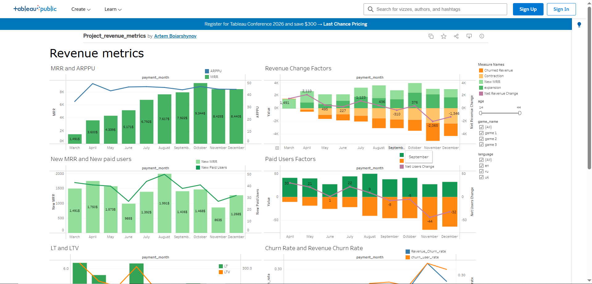

# Revenue Metrics Analysis

This project analyzes key SaaS revenue metrics using SQL and Tableau.

## Tools
- SQL (PostgreSQL)
- Tableau
- Python (pandas)

## Metrics analyzed
- MRR (Monthly Recurring Revenue)
- ARPPU
- Churn Rate
- New Paid Users
- Expansion / Contraction Revenue
- LTV

## Process
1. Data aggregation using SQL
2. Revenue metrics calculation with window functions
3. Data visualization in Tableau

## Dashboard

## Tableau Dashboard
https://public.tableau.com/app/profile/artem.boiarshynov
